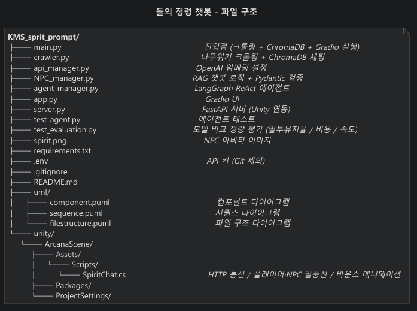
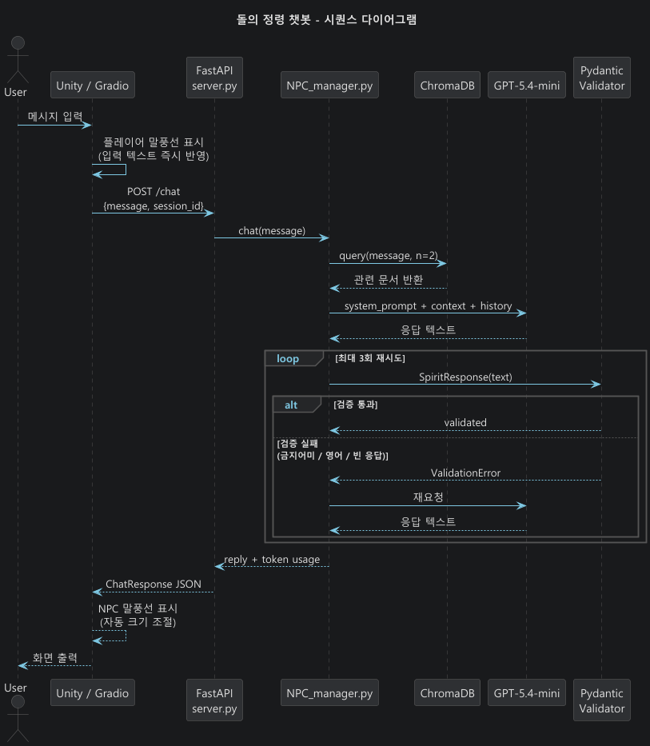
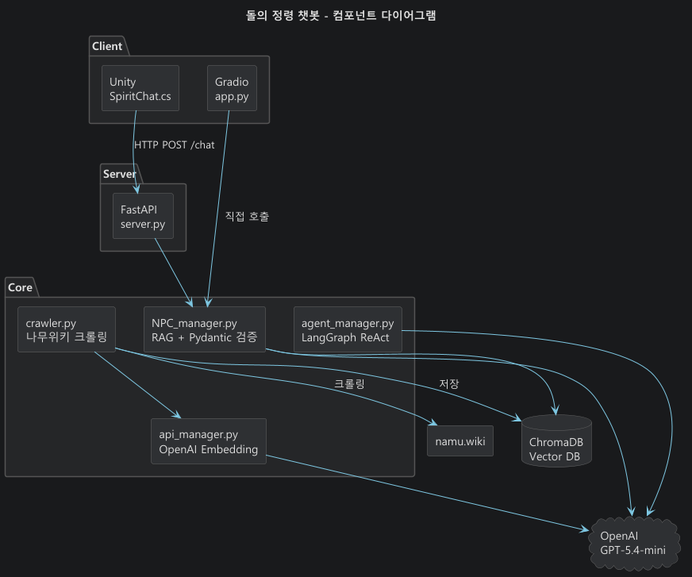

# 🍁 돌의 정령 챗봇


메이플스토리를 어릴 때부터 해왔는데, 아르카나 돌의 정령 말투가 특징이 있기때문에 이에 기반한 LLM으로 구현해보고 싶었습니다.<br> 
단순 프롬프트만 짜게 되면 세계관을 이해도가 낮아 봇 자체가 세계관 이외의 대답을 하기 때문에 RAG로 아르카나 데이터를 직접 구축해서 제작하였습니다. <br>
이후 단순 대화를 넘어 인게임 안에서의 정보를 스스로 조회하고 행동하는 에이전트로 고도화 하였습니다. <br>
최종적으로 FastAPI 서버를 통해 Unity 2D 씬과 연동하여 실제 게임 NPC처럼 동작하는 데모를 구현 하였습니다.<br>

```
용사: 물약이 필요해
정령: 물약이 한 개도 없담, 헤네시스 물약상점 NPC에서 살 수 있담
      원하면 길도 바로 알려주겠담
```

---

## 쓴 것들

| |                                           |
|---|-------------------------------------------|
| LLM | GPT-5.4-mini                              |
| Agent | LangGraph (ReAct)                         |
| Vector DB | ChromaDB                                  |
| Embedding | text-embedding-3-small                    |
| 크롤링 | BeautifulSoup4                            |
| 데이터 검증 | Pydantic v2                               |
| Python UI | Gradio                                    |
| API 서버 | FastAPI + uvicorn                         |
| Unity 클라이언트 | Unity 6.3 (Universal 2D), C#, TextMeshPro |

---

## 실행 방법

```bash
python -m venv maple-spirit
source maple-spirit/bin/activate  # Windows: maple-spirit\Scripts\activate
pip install -r requirements.txt
```

`.env` 파일 만들고 API 키 넣기

```
OPENAI_API_KEY=your_api_key_here
```

**Gradio UI 실행**
```bash
python main.py          # 크롤링 + ChromaDB 세팅 후 Gradio 실행
```

**FastAPI 서버 실행 (Unity 연동용)**
```bash
python server.py        # http://127.0.0.1:8080
```
---

## 파일 구조



---

## 구조




**RAG 챗봇 (NPC_manager.py)**
```
유저 입력 -> ChromaDB 검색 -> 컨텍스트 주입 -> GPT-5.4-mini -> Pydantic 검증 -> 돌의 정령 말투 응답
```

**에이전트 (agent_manager.py)**
```
유저 입력
    |
LangGraph ReAct 에이전트 (GPT-5.4-mini)
    | 스스로 판단
┌─────────────────────┐
│ check_inventory     │  인벤토리 / 메소 조회
│ find_shop           │  상점 위치 검색
│ get_route           │  이동 경로 안내
│ check_stats         │  캐릭터 스탯 / 전투력 조회
│ get_monster_info    │  몬스터 정보 조회
└─────────────────────┘
    |
돌의 정령 말투로 최종 답변
```

**Unity 연동 구조**
```
Unity (SpiritChat.cs)
    | HTTP POST /chat
FastAPI 서버 (server.py)
    | session_id 기반 히스토리 관리
NPC_manager.chat()
    | RAG + GPT + Pydantic 검증
응답 JSON -> Unity 말풍선 출력
```

---

## 만들면서 고민한 것들

- RAG 없이 테스트<br>
프롬프트만으로 돌의 정령 캐릭터를 구현하면 세계관 기반 질문에서 엉뚱한 답을 내거나 말투가 깨지는 경우가 종종 발생.<br>
나무위키에서 아르카나 스토리 데이터를 직접 크롤링해 ChromaDB에 구축한 뒤로는 퀘스트, 등장인물 관련 질문에도 정확하게 답하기 시작.
<br><br>
- 모델 nano VS mini<br>
처음엔 비용 절감을 위해 gpt-5.4-nano로 먼저 테스트해 보았고, <br>
말투 규칙 준수가 불안정하여 "좋달람"과 같은 잘못된 어미가 지속적으로 나왔음. <br>
mini로 변경 후 규칙 적용이 안정화되어 최종 채택. 토큰 단가는 높지만 품질 차이가 명확했음.
<br><br>
- 말투 교정<br>
처음엔 "~담, ~람 어미 써줘" 정도만 프롬프트에 넣었지만 "정령들담", "정령들이달람" 같은 어색한 표현이 지속적으로 도출.<br> 
허용/금지 예시를 few-shot 형식으로 정리하고 나서야 안정됨.


## 개선 과정 요약:
```
v1. 페르소나 + 기본 어미 규칙만 적용
    -> "좋달람", "있달람" 같은 잘못된 어미 지속 발생

v2. few-shot 예시 추가
    → 많이 나아졌지만 형용사 처리가 아직 어색함
      예) 좋아 → 좋아담(X), 정령들이다 → 정령들이담(X)

v3. "~이다 → ~담" 규칙 명시 + 프롬프트 압축
    → "~이담" 처리 안정화, 전반적으로 유지되는 편

v4. 동사/형용사/기타 어미 변환 규칙 분리 명시 + 금지 패턴 목록 추가
    → "되담", "오르담", "좋아담", "알아담" 같은 잘못된 변환 차단
    → 문장 전체를 먼저 자연스럽게 만든 뒤 마지막 어미만 바꾸도록 순서 명시
    → 형용사는 절대 '아/어'형으로 만들지 않도록 명시
      좋다→좋담(O) / 좋아담(X), 나쁘다→나쁘담(O), 크다→크담(O) / 큰담(X)

v5. 자기지칭 조사 결합 / ~ㄹ게 어미 / 역할 관계 / 검증 완화
    → 자기지칭 조사 결합 규칙 추가: 나+이/가 → 내가(O) / 나가(X)
    → ~ㄹ게 어미 처리 명시: 있을게담(X) → 있을거담(O), 도와줄게담(X) → 도와줄거담(O)
    → 역할 관계 명시: 용사가 정령을 도와주는 관계임을 프롬프트에 추가
      (반대로 "내가 도와줄게" 식으로 대답하던 문제 수정)
    → Pydantic SPIRIT_ENDING 검증 완화: 질문형 문장도 담/람 포함 시 허용
      ([담람]\W*$ → [담람]) 로 변경해 "~담?" 같은 응답도 통과되도록 처리
```

- Pydantic v2로 응답 무결성 강화<br>
***** 두 가지 상황을 고려하여 도입함 ******<br>
첫째, "돌의 정령에게 욕설을 가르치거나 Jailbreak로 부적절한 답변을 유도하면 어떻게 대응할 것인가"라는 문제. <br> 
프롬프트 가드레일만으로는 모델이 지시를 우회하는 경우를 완전히 막을 수 없어서,<br> 
코드 레벨에서 응답 자체를 검증하고 조건 불만족 시 재시도 또는 폴백으로 처리하는 구조가 필요함.
<br><br>
둘째, RAG 데이터가 한글과 영어 혼재일 때 영어 응답이 튀어나오는 경우,<br> 
크롤링 데이터 품질에 따라 컨텍스트가 영어로 섞이면 모델이 영어로 답하는 경우가 생겨,<br> 
한국어 포함 여부를 검증 조건으로 추가.
<br><br>
Pydantic field_validator로 4가지 조건(한국어 포함, 빈 응답 아님, 담/람 포함, 금지 어미 없음)을 검증하고,<br> 
실패 시 최대 3회 재시도 후 폴백 메시지로 처리. AI 출력을 코드 레벨에서 강제하는 구조.
<br><br>
- 단순 챗봇에서 에이전트로 테스트 및 고도화 작업<br>
RAG 챗봇만으로는 "물약이 필요해" 같은 요청에 인벤토리를 실제로 확인하거나 상점 위치를 찾는 행동을 할 수 없음.<br> 
LangGraph로 ReAct 에이전트를 구성하고 Tool Calling을 적용하면서 AI가 스스로 상황을 판단하고 필요한 함수를 순서대로 호출하는 구조로 전환.
```
"물약이 필요해" 입력 시 에이전트 사고 과정:
-> check_inventory('물약')    물약 0개 확인
-> find_shop('물약')          헤네시스 물약상점 NPC 확인
-> get_route('헤네시스')      이동 경로 확인
-> 세 가지 정보 종합해서 답변 생성
```

- API 키 보안 및 토큰 비용 관리
```
API 키는 `.env` 파일로 분리해 코드에 직접 노출되지 않도록 처리. `python-dotenv`로 런타임에 로드하는 구조라 
GitHub에 올려도 키가 유출되지 않음. 토큰 비용은 컨텍스트를 관리하지 않으면 생각보다 빠르게 나와서 아래 방법으로 40~50% 절감.
  - 시스템 프롬프트 압축 (규칙만 남기고 불필요한 설명 제거)
  - n_results 3 -> 2 (RAG 검색 결과 수 축소)
  - context 글자 수 500자로 제한 (MAX_CONTEXT_CHARS)
  - 대화 기록 최근 2턴만 유지 (MAX_HISTORY_TURNS)
  - max_completion_tokens=300 제한
```

- FastAPI로 Unity 브릿지 구성<br>
Gradio UI는 포트폴리오 데모용으로 유지하되, Unity에서 직접 대화할 수 있도록 FastAPI 서버를 별도로 구성.<br>
session_id 기반으로 멀티 유저 히스토리를 관리하고, CORS 설정으로 로컬 Unity 클라이언트에서 바로 호출 가능하게 처리.

- Unity 한글 렌더링<br>
TextMeshPro 기본 폰트의 한글 미지원 문제를 해결하기 위해 NotoSansKR-Regular로 TMP Font Asset을 별도 생성.<br>
기존의 한글 음절/자모 범위 직접 지정 방식 대신, SDF Font Asset 생성 후 Dynamic 설정을 적용해<br>
IME 입력 중 자모 깨짐과 한글 렌더링 문제를 안정적으로 해결.

---

## 추후 개선 방향 
- 실제 게임 데이터 연동 (game_state를 API로 동적으로 받아오는 구조)
- 친밀도 상태 변수 추가해서 대화 횟수에 따라 반응이 달라지는 구조 구현
- 다른 아르카나 정령 캐릭터 추가
- 크롤링 데이터 확장 (사냥터, 스펙업 정보)
